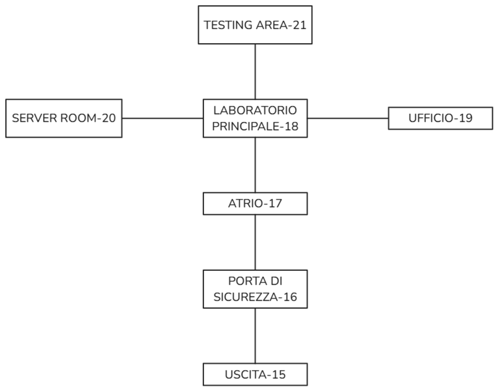
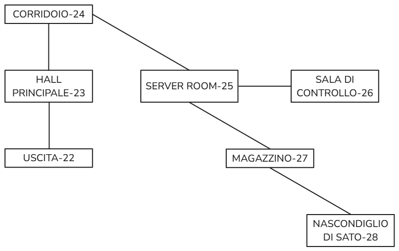

# Report - Heartcode: il Virus

## Indice
- [Componenti del gruppo](#Componenti-del-gruppo)
- [Descrizione del caso di studio](#Descrizione-del-caso-di-studio)
- [Diagramma delle classi](#Diagramma-delle-classi)
- [Specifica algebrica](#Specifica-algebrica)
- [Applicazione degli argomenti del corso](#Applicazione-degli-argomenti-del-corso)
- [Struttura del Database](#Struttura-del-Database)
  - [Tabella `Edifici`](#Tabella-Edifici)
  - [Tabella `Stanze`](#Tabella-Stanze)
  - [Tabella `DescrizioniStanze`](#Tabella-DescrizioniStanze)
  - [Tabella `Oggetti`](#Tabella-Oggetti)
  - [Tabella `OggettiStanze`](#Tabella-OggettiStanze)
  - [Tabella `Movimenti`](#Tabella-Movimenti)
- [Azioni](#Azioni)
- [Trama del gioco](#Trama-del-gioco)
- [Mappa del gioco](#Mappa-del-gioco)
  - [Ospedale di Neo Tokyo - 01](#Ospedale-di-Neo-Tokyo---01)
  - [Clinica del Dott. Tanaka - 02](#Clinica-del-Dott.-Tanaka---02)
  - [Nascondiglio di Sato - 03](#Nascondiglio-di-Sato---03)

## Componenti del gruppo

## Descrizione del caso di studio

## Diagramma delle classi

## Specifica algebrica

## Applicazione degli argomenti del corso

## Struttura del Database

### Tabella `Edifici`
Contiene informazioni sugli edifici del gioco.

| Attributo      | Tipo          | Vincoli                       | Descrizione                                           |
|----------------|---------------|-------------------------------|-------------------------------------------------------|
| `edificio_id`  | `VARCHAR(2)`  | `PRIMARY KEY`                 | Identificativo univoco dell'edificio (es: "01").      |
| `nome`         | `VARCHAR(100)`| `NOT NULL`, `UNIQUE`          | Nome dell'edificio (es: "Ospedale").                 |
| `accessibile`  | `BOOLEAN`     | `DEFAULT true`                | Se l'edificio è accessibile (default: `true`).       |
| `descrizione`  | `TEXT`        |                               | Descrizione breve dell'edificio.                     |

---

### Tabella `Stanze`
Contiene informazioni sulle stanze presenti negli edifici.

| Attributo      | Tipo          | Vincoli                       | Descrizione                                           |
|----------------|---------------|-------------------------------|-------------------------------------------------------|
| `edificio_id`  | `VARCHAR(2)`  | `NOT NULL`, `FOREIGN KEY`     | Collegamento all'edificio a cui appartiene la stanza. |
| `stanza_id`    | `VARCHAR(2)`  | `PRIMARY KEY`                 | Identificativo univoco della stanza (es: "01").       |
| `nome`         | `VARCHAR(100)`| `NOT NULL`                    | Nome della stanza (es: "Reception").                 |
| `accessibile`  | `BOOLEAN`     | `DEFAULT true`                | Se la stanza è accessibile (default: `true`).        |

**Relazioni:**  
La tabella `Stanze` ha un vincolo di chiave esterna su `edificio_id` che fa riferimento a `Edifici(edificio_id)`.

---

### Tabella `DescrizioniStanze`
Contiene le descrizioni dettagliate delle stanze.

| Attributo            | Tipo          | Vincoli                       | Descrizione                                           |
|----------------------|---------------|-------------------------------|-------------------------------------------------------|
| `edificio_id`        | `VARCHAR(2)`  | `PRIMARY KEY`, `FOREIGN KEY`  | Identificativo dell'edificio.                        |
| `stanza_id`          | `VARCHAR(2)`  | `PRIMARY KEY`, `FOREIGN KEY`  | Identificativo univoco della stanza.                 |
| `descrizione_breve`  | `TEXT`        |                               | Breve descrizione visibile da stanze vicine.         |
| `descrizione_completa`| `TEXT`        |                               | Descrizione completa della stanza.                   |

**Relazioni:**  
La tabella `DescrizioniStanze` ha vincoli di chiave esterna su `stanza_id` e `edificio_id`, che fanno riferimento rispettivamente a `Stanze(stanza_id)` e `Stanze(edificio_id)`.

---

### Tabella `Oggetti`
Contiene informazioni sugli oggetti presenti nel gioco.

| Attributo      | Tipo          | Vincoli                       | Descrizione                                           |
|----------------|---------------|-------------------------------|-------------------------------------------------------|
| `oggetto_id`   | `VARCHAR(3)`  | `PRIMARY KEY`                 | Identificativo univoco dell'oggetto (es: "001").      |
| `nome`         | `VARCHAR(100)`| `NOT NULL`, `UNIQUE`          | Nome dell'oggetto.                                   |
| `descrizione`  | `TEXT`        |                               | Descrizione dell'oggetto.                            |
| `raccoglibile` | `BOOLEAN`     | `DEFAULT false`               | Indica se l'oggetto è raccoglibile.                  |

---

### Tabella `OggettiStanze`
Associa oggetti a stanze specifiche.

| Attributo      | Tipo          | Vincoli                       | Descrizione                                           |
|----------------|---------------|-------------------------------|-------------------------------------------------------|
| `oggetto_id`   | `VARCHAR(3)`  | `PRIMARY KEY`, `FOREIGN KEY`  | Collegamento all'oggetto.                            |
| `stanza_id`    | `VARCHAR(2)`  | `PRIMARY KEY`, `FOREIGN KEY`  | Collegamento alla stanza in cui si trova l'oggetto.  |
| `edificio_id`  | `VARCHAR(2)`  | `PRIMARY KEY`, `FOREIGN KEY`  | Collegamento all'edificio in cui si trova la stanza. |

**Relazioni:**  
La tabella `OggettiStanze` ha vincoli di chiave esterna su `oggetto_id`, `stanza_id` e `edificio_id`, che fanno riferimento rispettivamente a `Oggetti(oggetto_id)`, `Stanze(stanza_id)` e `Stanze(edificio_id)`.

---

### Tabella `Movimenti`
Definisce i collegamenti tra le stanze nelle varie direzioni.

| Attributo     | Tipo         | Vincoli                        | Descrizione                                            |
|---------------|--------------|--------------------------------|--------------------------------------------------------|
| `edificio_id` | `VARCHAR(2)` | `PRIMARY KEY`, `FOREIGN KEY`   | Identificativo dell'edificio.                         |
| `stanza_id`   | `VARCHAR(2)` | `PRIMARY KEY`, `FOREIGN KEY`   | Identificativo della stanza.                          |
| `nord`        | `VARCHAR(2)` | `FOREIGN KEY`                  | Stanza raggiungibile muovendosi a nord.               |
| `sud`         | `VARCHAR(2)` | `FOREIGN KEY`                  | Stanza raggiungibile muovendosi a sud.                |
| `est`         | `VARCHAR(2)` | `FOREIGN KEY`                  | Stanza raggiungibile muovendosi a est.                |
| `ovest`       | `VARCHAR(2)` | `FOREIGN KEY`                  | Stanza raggiungibile muovendosi a ovest.              |
| `alto`        | `VARCHAR(2)` | `FOREIGN KEY`                  | Stanza raggiungibile muovendosi verso l'alto.         |
| `basso`       | `VARCHAR(2)` | `FOREIGN KEY`                  | Stanza raggiungibile muovendosi verso il basso.       |

**Relazioni:**  
La tabella `Movimenti` ha vincoli di chiave esterna su:
- `edificio_id`, che fa riferimento a `Edifici(edificio_id)`.
- `stanza_id`, che fa riferimento a `Stanze(stanza_id)`.
- `nord`, `sud`, `est`, `ovest`, `alto`, `basso`, che fanno riferimento a `Stanze(stanza_id)`.

## Azioni
### Movimento
- Nord
- Sud
- Est
- Ovest
- Alto
- Basso

### Generali
- Esci
- Salva
- Inventario
- Guarda
- Osserva

### Interazione
- Esamina
- Prendi
- Lascia
- Usa
- Apri
- Chiudi
- Parla

## Trama del gioco

### **Prologo**: Nuovo Distretto
- Il protagonista, un agente di polizia, viene assegnato a un nuovo distretto a Neo Tokyo.
- Durante il primo turno, una chiamata informa di una morte sospetta presso l'ospedale della città.

### **Capitolo 1**: Indagini in Ospedale
1. **Arrivo in Ospedale**:
   - L'agente si reca in auto presso l'ospedale per raccogliere maggiori informazioni.
   - Alla reception, parla con l'assistente del dottore, che lo indirizza verso la stanza della vittima.
2. **Indizi nella Stanza della Vittima**:
   - Trova un biglietto da visita del dott. Tanaka.
   - Riceve una nuova chiamata dalla centrale: un altro caso di morte sospetta viene segnalato. Anche in questo caso, la vittima portava un pacemaker difettoso.
3. **Analisi del Pacemaker**:
   - L'agente si reca al laboratorio tecnico dell'ospedale.
   - Scopre che il pacemaker contiene un virus che altera il battito cardiaco inviando impulsi letali al cuore.
4. **Nuovo Indizio**:
   - Gli agenti scoprono che la vittima era stata dal dott. Tanaka pochi giorni prima.
   - L'agente collega questo messaggio al biglietto da visita trovato nella stanza della vittima.

### **Capitolo 2**: La Clinica del Dott. Tanaka
1. **Scoperta della Clinica**:
   - L'agente si reca alla clinica del dott. Tanaka, che appare vuota.
   - All'interno trova un registro degli appuntamenti con una lista di persone che avevano visitato la clinica.
2. **Indizi nella Clinica**:
   - Accede al computer del dottore e scopre un software per controllare da remoto i pacemaker.
   - Trova il corpo del dott. Tanaka, morto, con un mazzo di chiavi al collo.
3. **Hard Disk e Video**:
   - Trova un hard disk contenente file criptati.
   - Decifra i file e scopre filmati delle telecamere che mostrano una persona, identificata come Sato, entrare nella clinica.

### **Capitolo 3**: La Connessione con Sato
1. **Ricerca su Sato**:
   - L'agente scopre che Sato è un programmatore esperto.
   - Trova un ritaglio di giornale che rivela la storia di Sato: sua sorella era una paziente del dott. Tanaka e morì a causa di esperimenti medici falliti.
2. **Scoperta del Nascondiglio**:
   - Analizzando il registro degli appuntamenti della clinica, l'agente nota orari sospetti (ad esempio, mezzanotte).
   - I pazienti a quegli orari usavano nomi falsi, e le prime lettere dei nomi formano l'indirizzo del nascondiglio di Sato.

### **Capitolo 4**: Il Nascondiglio di Sato
1. **Ingresso**:
   - L'agente si reca al nascondiglio e trova una porta di sicurezza, che riesce ad aprire risolvendo un puzzle.
2. **Il Piano di Sato**:
   - Sato sta pianificando un attacco informatico per uccidere persone con pacemaker, in segno di vendetta contro il dott. Tanaka.
   - Parte un timer: l'agente deve fermare l'attacco risolvendo una serie di minigame al computer.

### **Epilogo**: Finale Ramificato
1. **Finale Positivo**:
   - L'agente disattiva l'attacco in tempo, salvando le vittime.
   - Riesce ad aprire la porta dove si trova Sato e lo arresta, portando prove schiaccianti.
2. **Finale Negativo**:
   - Se fallisce nel disattivare l'attacco, molte persone muoiono.
   - Se non riesce ad aprire la porta in tempo, Sato cancella tutte le prove e, nonostante venga arrestato, viene rilasciato.

## Mappa del gioco

### Ospedale di Neo Tokyo - 01

| Codice | Luogo              |Nord|Sud|Est|Ovest|Alto|Basso|
|--|--------------------|--|-|--|--|--|--|
|01|Uscita|Ingresso|-|Porta di Sicurezza-16|-|-|-|
|02|Ingresso|Reception|Uscita|-|-|-|-|
|03|Reception|Cappella|Ingresso|Sala d'attesa|-|Corridoio1.1|-|
|04|Sala d'attesa|-|-|-|Reception|-|-|
|05|Cappella|-|Reception|-|-|-|-|
|06|Corridoio1.1|Corridoio1.2|-|Camera201|Camera200|-|Reception|
|07|Corridoio1.2|-|Corridoio1.1|Camera203|Camera202|Corridoio2|-|
|08|Stanza200|-|-|Corridoio1.1|-|-|-|
|09|Sanza201|-|-|-|Corridoio1.1|-|-|
|10|Sanza202|-|-|Corridoio1.2|-|-|-|
|11|Sanza203|-|-|-|Corridoio1.2|-|-|
|12|Corridoio2|-|Ufficio Dr. Chen|-|-|-|Corridoio1.2|
|13|Ufficio Dr. Chen|Corridoio2|-|-|-|-|-|
|14|Laboratorio medico|-|-|-|Corridoio2|-|-|

### Clinica del Dott. Tanaka - 02

|Codice|Luogo|Nord|Sud|Est|Ovest|Alto|Basso|
|--|--|--|--|--|--|--|--|
|15|Uscita|Porta di Sicurezza|-|Hall Principale-23|Ingresso-02|-|-|
|16|Porta di Sicurezza|Atrio|Uscita|-|-|-|-|
|17|Atrio|Laboratorio Principale|Porta di Sicurezza|-|-|-|-|
|18|Laboratorio Principale|Testing Area|Atrio|Ufficio|Server Room|-|-|
|19|Ufficio|-|-|-|Laboratorio Principale|-|-|
|20|Server Room|-|-|Laboratorio Principale|-|-|-|
|21|Testing Area|-|Laboratorio Principale|-|-|-|-|

### Magazzino abbandonato (Nascondiglio di Sato) - 03

|Codice|Luogo|Nord|Sud|Est|Ovest|Alto|Basso|
|--|--|--|--|--|--|--|--|
|22|Uscita|Halla Principale|-|-|Porta di sicurezza-16|-|-|
|23|Hall Principale|Corridoio|Uscita|-|-|-|-|
|24|Corridoio|-|Hall Principale|-|-|-|Server Room|
|25|Server Room|-|-|Sala di Controllo|-|Corridoio|Magazzino|
|26|Sala di Controllo|-|-|-|Server Room|-|-|
|27|Magazzino|-|-|-|-|Server Room|Nascodiglio di Sato|
|28|Nascodiglio di Sato|-|-|-|-|-|Magazzino|